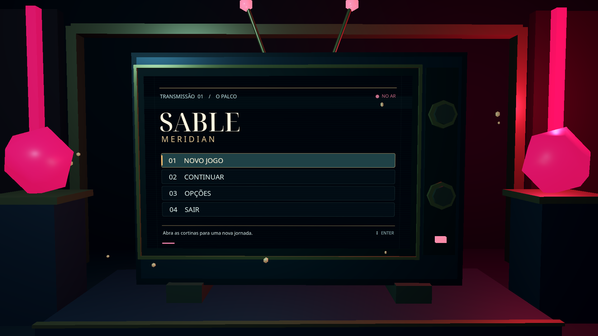

# SABLE MERIDIAN

Protótipo de ação em terceira pessoa feito em Godot 4.7. O pátio de treino leva a uma cidade gótica em construção; o foco atual é movimento, combate e apresentação visual.

## O que já funciona

- Combos de quatro golpes com launcher, ataques aéreos, esquiva com invulnerabilidade e esquiva perfeita com câmera lenta.
- Movimento e saltos em paredes, com limite ampliado por orbes coletadas; foco em alvos e ranking de estilo D–S.
- Cajado coletável no pátio, Adagas de Cartas, Máscara do Riso e relíquia Bilhete do Bis. A troca de arma durante um golpe entra na próxima janela de combo. O Baralho Maldito consome mana e dispara uma carta ou três após o segundo golpe.
- HUD de vida e mana com avisos contextuais, interação e diálogo com NPC, tela inicial em televisão 3D, pausa e opções persistentes de vídeo, áudio e câmera.
- Passagem física com névoa entre o pátio e a cidade, iluminação toon e personagem em `AnimatedSprite3D` com oito imagens direcionais de repouso. O modelo 3D do personagem permanece na cena, mas está oculto na apresentação atual.

O progresso salvo inclui as orbes de salto em parede. **Continuar** retorna ao pátio quando há orbes salvas; posição, combate e progresso de campanha não são salvos. **Novo jogo** limpa as orbes.

## Controles

| Entrada | Ação |
| --- | --- |
| `WASD` | Mover |
| `Espaço` | Pular ou saltar da parede |
| `Shift` | Esquivar |
| Mouse esquerdo / direito | Ataque leve / pesado, após obter o cajado |
| Mouse do meio | Focar ou liberar alvo |
| `Q` | Baralho Maldito |
| `1` / `2` | Cajado / Adagas de Cartas, após obter o cajado |
| `Tab` | Equipar ou retirar a Máscara do Riso |
| `F` | Interagir; revelar ou avançar diálogo |
| Roda do mouse | Aproximar ou afastar câmera |
| `Esc` | Pausa, voltar das opções ou encerrar diálogo |
| `F3` | Informações de depuração |

Na tela inicial, use mouse ou setas e `Enter` para selecionar. A lista de atalhos também aparece na tela inicial e na pausa.

## Executar

1. Abra esta pasta no **Godot 4.7.x** com o renderizador **GL Compatibility**.
2. Execute o projeto com `F5`. A cena inicial é `scenes/ui/title_screen.tscn`.
3. Inicie o jogo, colete o cajado no centro do pátio e atravesse a névoa sob o arco para chegar à cidade. Clique na janela para capturar o mouse durante o jogo.

## Documentação

- [Arquitetura](docs/architecture.md) · [Equipamento](docs/equipment.md) · [Habilidades](docs/combat_abilities.md)
- [Contribuição](docs/contributing.md) · [Validação](docs/validation.md) · [Roadmap](docs/roadmap.md)

Licença: [MIT](LICENSE).
